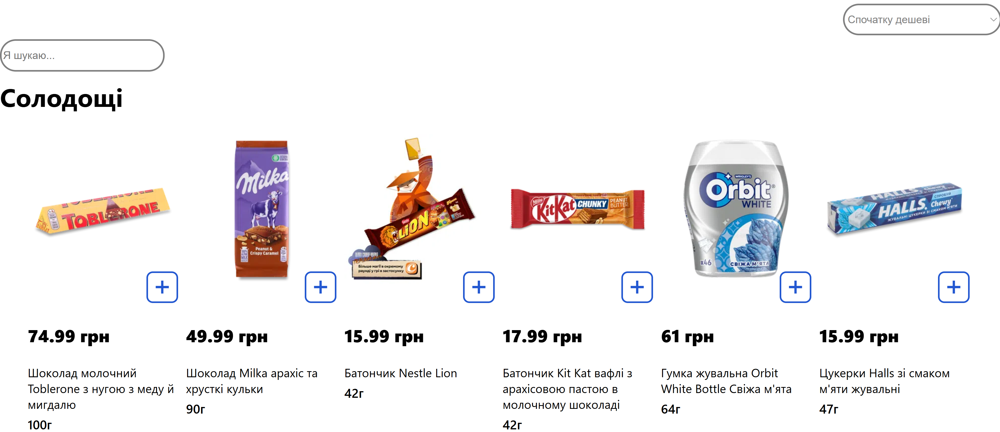

Mini React Shop

##  English

> This is a small demo React app inspired by the "Sweets" category of a popular Ukrainian supermarket.

A simple e-commerce React application that allows users to browse a product catalog, filter by name, sort items, and manage a shopping cart with real-time total cost calculation.

###  Features

- Product catalog with images and descriptions
- Search filter by title
- Sorting:
  - By price (ascending/descending)
  - By title (A–Z / Z–A)
- Add to cart and adjust quantity
- Real-time total price calculation

###  Tech Stack

- React (Hooks: useState, useEffect)
- JavaScript (ES6)
- CSS
- JSX

###  Screenshot


###  Installation

```bash
git clone https://github.com/Margarita792/react-mini-shop.git
cd react-mini-shop
npm install
npm start


## Українська

> Це невеликий демонстраційний React-додаток, натхненний категорією "Солодощі" популярного українського супермаркету.

Простий React-додаток для електронної комерції, який дозволяє користувачам переглядати каталог товарів, фільтрувати за назвою, сортувати товари та керувати кошиком для покупок з розрахунком загальної вартості в режимі реального часу.

### Функції

- Каталог товарів із зображеннями та описами
- Фільтр пошуку за назвою
- Сортування:
- За ціною (за зростанням/спаданням)
- За назвою (A–Z / Z–A)
- Додавання до кошика та налаштування кількості
- Розрахунок загальної ціни в режимі реального часу

### Технічний стек

- React (Хуки: useState, useEffect)
- JavaScript (ES6)
- CSS
- JSX

### Встановлення

```bash
git clone https://github.com/Margarita792/react-mini-shop.git
cd react-mini-shop
npm install
npm start